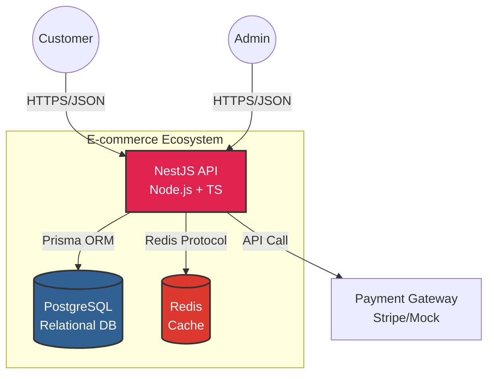

# Enterprise E-commerce API

> A high-performance, scalable RESTful API built with **NestJS**, designed to handle complex e-commerce scenarios, concurrency, and caching strategies.

---

## 📖 About The Project

This project simulates a backend for a large-scale e-commerce platform. The main goal is not just to build a CRUD, but to solve real-world engineering challenges such as **race conditions in inventory management**, **high-performance caching**, and **scalable architecture**.

It follows **Clean Architecture** principles and uses a **Modular Monolith** approach, ensuring the code remains maintainable and testable as the business logic grows.

### Key Features (Planned & Implemented)

* **🔐 Authentication & Authorization:** JWT-based auth with Role-Based Access Control (RBAC) (Admin/Customer).
* **📦 Inventory Management:** Concurrency-safe stock handling using **ACID Transactions** (PostgreSQL) to prevent overselling.
* **⚡ Performance:** **Redis** implementation for caching heavy read operations (e.g., Product Listings).
* **🛒 Order Processing:** Complex checkout logic validating stock, applying discounts, and simulating payment gateways.
* **🐳 DevOps:** Fully containerized environment with **Docker & Docker Compose** for easy setup.
* **🧪 Quality Assurance:** Unit and E2E testing with **Jest**.
* **📄 Documentation:** Auto-generated API documentation using **Swagger/OpenAPI**.

---

## 🛠️ Tech Stack

* **Runtime:** Node.js
* **Framework:** NestJS (Express adapter)
* **Language:** TypeScript
* **Database:** PostgreSQL
* **ORM:** Prisma
* **Cache:** Redis
* **Containerization:** Docker
* **Testing:** Jest

---

## 🗺️ Roadmap & Progress

This project is currently under active development.

- [x] **Phase 1: Setup & Architecture**
    - [x] Project initialization with NestJS
    - [x] Docker Compose setup (Postgres + Redis)
    - [x] Prisma ORM configuration
- [ ] **Phase 2: Core Domains**
    - [ ] Users & Auth Module (JWT, Guards)
    - [ ] Products Module (CRUD, Pagination, Filtering)
- [ ] **Phase 3: Business Logic**
    - [ ] Cart & Orders Module
    - [ ] **Transactional Inventory Logic** (The "Hard" Part)
- [ ] **Phase 4: Performance & DevOps**
    - [ ] Redis Caching implementation
    - [ ] CI/CD Pipelines (GitHub Actions)
    - [ ] Cloud Deployment (AWS)

---

## ⚙️ Getting Started

Follow these steps to run the project locally.

### Prerequisites

* Node.js (v18+)
* Docker & Docker Compose
* npm or yarn

### Installation

1.  **Clone the repository**
    ```bash
    git clone [https://github.com/cerqueiracesar/enterprise-ecommerce-api.git](https://github.com/cerqueiracesar/enterprise-ecommerce-api.git)
    cd enterprise-ecommerce-api
    ```

2.  **Install dependencies**
    ```bash
    npm install
    ```

3.  **Environment Setup**
    Duplicate the `.env.example` file and rename it to `.env`:
    ```bash
    cp .env.example .env
    ```

4.  **Run Infrastructure (DB & Cache)**
    ```bash
    docker-compose up -d
    ```

5.  **Run Migrations**
    ```bash
    npx prisma migrate dev
    ```

6.  **Start the Server**
    ```bash
    npm run start:dev
    ```

The API will be available at `http://localhost:3000`.
Access Swagger Docs at `http://localhost:3000/api/docs`.

---

## 🏛️ System Architecture

The project follows a **Modular Monolith** architecture. Below is a diagram illustrating the interactions between the API, Data Stores, and External Services.



The project is structured into **Modules** (Auth, Users, Products, Orders) to maintain separation of concerns.

---

## 🤝 Contact

**Rodrigo C. Cerqueira César**
* **LinkedIn:** [Your LinkedIn Profile](https://www.linkedin.com/in/seu-perfil)
* **Email:** [Your Email]

---
